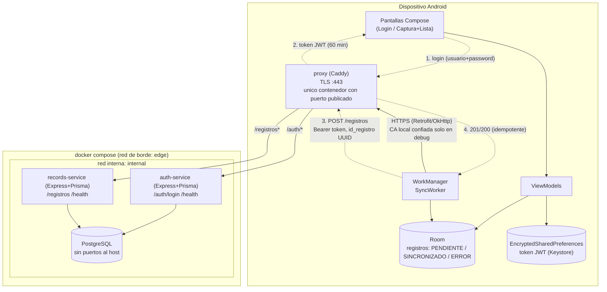

# Arquitectura

Prueba técnica FullStack Móvil — SOFRATESA. Técnico de mantenimiento que
captura registros en campo, con y sin conectividad, y sincroniza contra un
backend propio corriendo 100% en local vía Docker Compose.

## Diagrama

**Recorrido de la información:**
1. Con conectividad, la app envía usuario/contraseña a `auth-service` (vía el
   proxy). Si son válidas, recibe un JWT con expiración y lo guarda cifrado.
2. El técnico captura registros en cualquier momento; siempre se guardan
   primero en Room, local, en estado `PENDIENTE`.
3. Al iniciar la app con conectividad, o al recuperar la conexión, se
   dispara `SyncWorker` (WorkManager), que envía cada registro pendiente o
   en error a `records-service`, autenticando con el Bearer token.
4. `records-service` valida el token (nunca confía en un usuario del body),
   valida el contenido, y lo inserta en PostgreSQL de forma idempotente por
   `id_registro`. Confirma con 201 (nuevo) o 200 (ya existía).
5. La app marca el registro local como `SINCRONIZADO` solo tras la
   confirmación explícita del servidor.

## Componentes y por qué

| Componente | Elección | Justificación |
|---|---|---|
| App Android | Kotlin + Jetpack Compose | Stack nativo moderno recomendado por Google; menos boilerplate que Views para las 2 pantallas pedidas. |
| Persistencia local | Room (SQLite) | Estándar de Android para persistencia offline-first, con `Flow` para observar la lista en tiempo real sin polling. |
| Cliente HTTP | Retrofit + OkHttp | Manejo de JSON, interceptor de `Authorization: Bearer`, y respeta automáticamente `network_security_config.xml` para TLS (no requiere código extra de pinning). |
| Sesión | EncryptedSharedPreferences (androidx.security, respaldado por Android Keystore) | Cumple el requisito de no guardar el token en texto plano; la clave de cifrado nunca sale del hardware. |
| Sincronización en background | WorkManager con `Constraints(NetworkType.CONNECTED)` | Sobrevive a que la app se cierre a mitad de un intento, reintenta con backoff, y es la forma recomendada por Android para trabajo diferible con restricciones de red. |
| Backend | Node.js + Express + TypeScript, dos servicios independientes | Rapidez de desarrollo, contrato HTTP simple, y separación clara auth/registros pedida por el enunciado. |
| Acceso a datos | Prisma ORM | Consultas parametrizadas por diseño (evita inyección SQL), migraciones versionadas y tipado desde el schema. |
| Hash de contraseña | bcrypt (cost 12) | Algoritmo adaptativo estándar de la industria, cumple el requisito de sección 9.1. |
| Idempotencia | `id_registro` como *primary key* en PostgreSQL + `ON CONFLICT`/captura de `P2002` | La garantía de "no duplicar" vive en la base de datos, no en lógica de aplicación que podría tener condiciones de carrera. |
| Proxy inverso | Caddy | TLS con certificado propio vía una sola directiva (`tls cert key`), sintaxis mínima, único contenedor con puerto publicado al host. |
| Base de datos | PostgreSQL 16 | Requisito del enunciado. Solo en la red `internal`, sin puertos al host. |
| Orquestación | Docker Compose, dos redes (`edge`, `internal`) | Aísla PostgreSQL de cualquier acceso directo externo; solo el proxy toca la red externa. |

## Supuestos asumidos

- **Un solo usuario de prueba, un solo rol.** No hay pantalla de registro ni
  gestión de usuarios (excluido explícitamente en el alcance).
- **"Conectividad" para disparar login/sync** se interpreta como que el
  dispositivo tiene una interfaz de red activa con capacidad de salir a
  internet (`NET_CAPABILITY_INTERNET`), no que haya sido *validada* por
  Android contra servidores de Google (`NET_CAPABILITY_VALIDATED`): en un
  entorno 100% local esa validación puede no completarse nunca aunque la
  ruta hacia el backend funcione perfectamente.
- **Sincronización registro por registro** (no por lote): más simple de
  razonar para la idempotencia y suficiente para el volumen de esta PoC: el
  enunciado acepta ambas opciones.
- **Emulador por defecto**: la URL del backend apunta a `10.0.2.2` (alias
  del emulador hacia el host). Para dispositivo físico se documenta el
  cambio en `MANUAL_INSTALACION.md`.
- **Reintentos de un registro en `ERROR`**: se resuelven reutilizando el
  mismo disparo general de sincronización (botón "Sincronizar ahora" o
  automático), ya que el propio `SyncWorker` reintenta todo lo que no esté
  `SINCRONIZADO`, incluyendo los que quedaron en `ERROR`. No se implementó
  un reintento individual por fila porque el efecto es idéntico y evita
  duplicar lógica.
